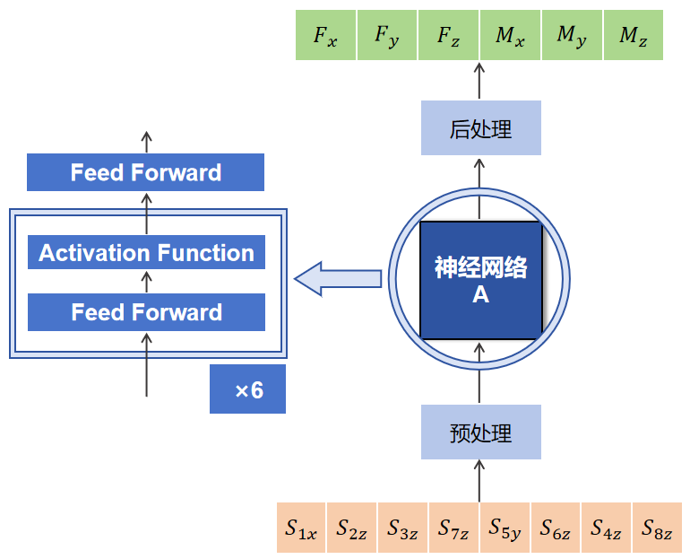
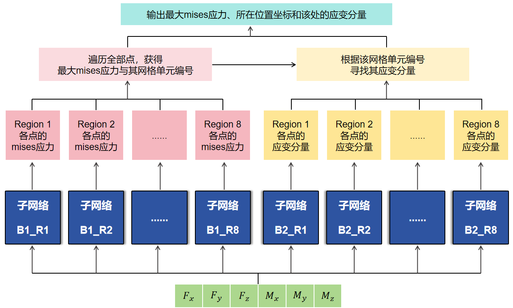
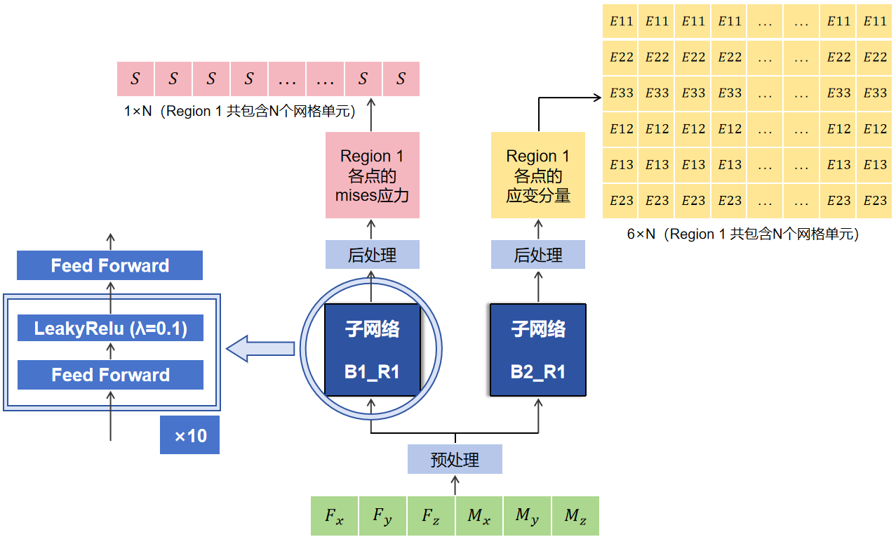
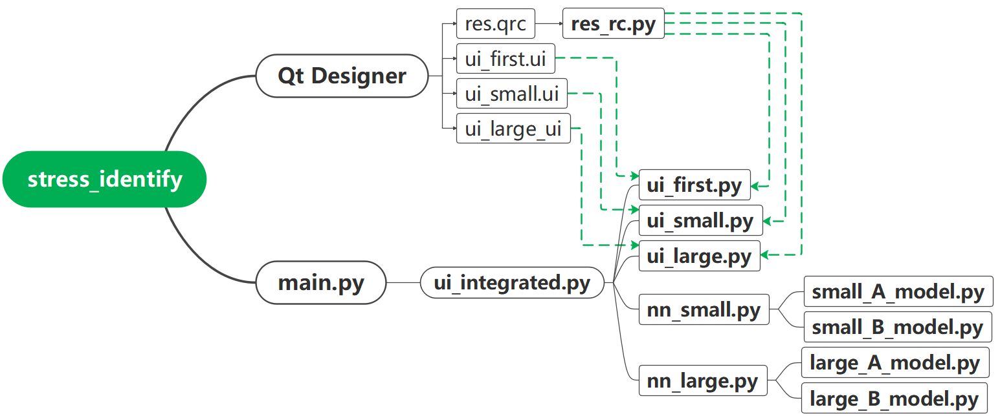
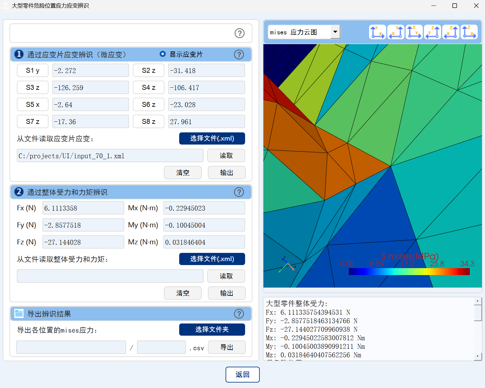
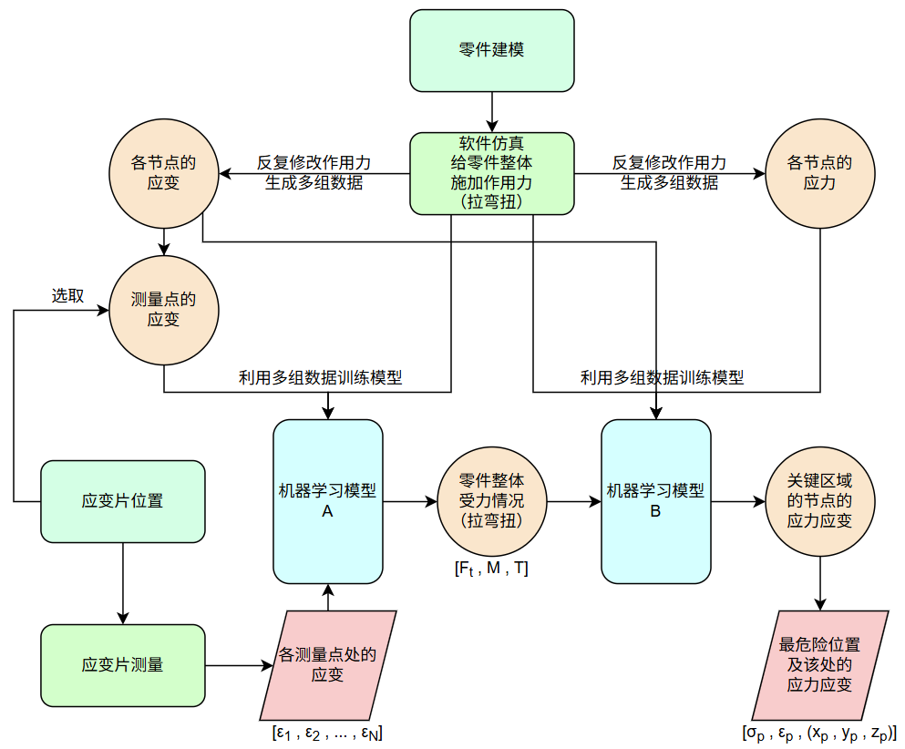

# Stress and Strain AI Identification of Spacecraft Parts

This Project belongs to Beijing Institute of Spacecraft Environment Engineering (BISEE), cooperated with ESCAAS (Beijing) Corporation and Peking University.

The code was developed by P.H. Zhang (2025).

## Background

The development of spacecraft represents the progress of modern society. Due to the unique characteristics of spacecraft motion and the space environment, high requirements are proposed on spacecraft parts. A key step during spacecraft part design is to quickly locate the dangerous zone on part and acquire overall stress and strain distribution under given working conditions.

Traditional methods use simulation software such as Abaqus to solve the problem. However, simulation software are slow, cumbersome, and having high learning threshold. A new approach is to use neural networks as surrogation of simulation software, which has high computational efficiency, significantly reduce time costs.

## Abstract

In this project, we have two aircraft parts, named Large Part and Small Part. The structure of parts keep confidential. Each part is attached with several strain gauges. The location of strain gauges are fixed and the strain of them can be accurately measured. Actually, The strain of strain gauges are the only information we can get. We aim to design a program, taking the strain of strain gauges only as input, to output stress and strain at every location throughout the part.

We trained two neural networks as AI model to solve the problem, named NNA and NNB. This two neural networks work in series. NNA takes the strain of strain gauges only as input, and outputs the external load of the part. NNB takes the output of NNA as input, which is the external load of the part, and outputs stress and strain at every location throughout the part.

We choose Abaqus for simulation to generate dataset for each part. We used parallelization to accelerate simulation and obtained tens of thousands of data. The datasets are abundant enough to train AI model.

We designed a humanized interface which encapsulates the above functions. As long as obtaining the strain of the strain gauges measured by device, the AI ​​model can immediately calculate the external load and stress strain distribution of the part. Then the stress and strain cloud map will be immediately drawn on the interface, while inidcating the location with the maximum stress.

## Overview

- **Spacecraft parts**: Two parts in total, Large Part and Small Part.
- **Datasets**: (*./make_dataset*) Abaqus simulation to make datasets. Run Abaqus in bash without GUI and use parallelization to quickly generate data.
- **AI model**: (*./neural network*) Two sequential neural networks. From the strain of the strain gauges to external load, from external load to stress and strain distribution.
- **User interface**: (*./UI*) QtDesigner to design UI. PyQt5 to write code.

## File Structure

Due to confidentiality requirements, some documents are not public and have not been uploaded. For example, the res.qrc and res_rc.py in /UI involve the structure picture of parts, which are confidential and not uploaded.

Uploaded files structure is as follows:

```
├── make_dataset                            # Make datasets to train AI
    ├── part_configuration.xml              # Settings for making datasets
    └── ...                         
├── neural network                          # AI model
    ├── NN_large_A                          # AI model for force identification of large part
        ├── large_A_shuffle.py              # Shuffle the train and test datasets
        ├── large_A_selfdataset.py          # Read datasets
        ├── large_A_model.py                # Model structure
        ├── large_A_train.py                # Train AI model
        └── large_A_test.py                 # Test AI model
    ├── NN_large_B                          # AI model for stress and strain identification of large part
        └── ...
    └── ... 
├── UI                                      # User interface
    ├── main.py                             # Run to start user interface of program
    ├── ui_first.ui                         # Main interface Window designed by QtDesigner
    ├── ui_first.py                         # Main interface Window code directly generated by pyuic5
    ├── ...
    ├── ui_integrated.py                    # Define function on interface
    ├── nn_large.py                         # Bridge function between model structure and interface
    ├── large_A_model.py                    # Model structure, the same with the file in neural network folder
    ├── ...
    ├── input.xml                           # Example of an input xml file
    ├── sample_large_part.txt               # Evaluation of output of program
    └── ...
└── readme.md                               # This file  
```

## Datasets

### How to make datasets

- Model the parts (Mesh, Assembly, Step, Interaction, Boundary): Large Part and Small Part.
- Define sets of external loads.
- For an external load, use Abaqus simulation to calculate the stress and strain throughout the part.
- According to the location of strain gauges, calculate the strain of strain gauges from strain distribution.
- Make the strain of strain gauges, external load, stress and strain distribution into csv files.
- Use Abaqus simulation parallelly to calculate all sets of external loads to obtain all the samples (each external load is a sample).
- Use some data augmentation techniques to extend the datasets.

Since we have two neural networks, one sample $(\mathbf{C}, (\mathbf{F}, \mathbf{M})^\top, (\mathbf{S}, \mathbf{E})^\top)$ is split into two. $(\mathbf{C}, (\mathbf{F}, \mathbf{M})^\top)$ for training neural network A. $((\mathbf{F}, \mathbf{M})^\top, (\mathbf{S}, \mathbf{E})^\top)$ for training neural network B.

We have made 67285 samples for Large Part and 62234 samples for Small Part. After data augmentation, we double the number of available samples. In total, 134570 samples for Large Part and 124486 samples for Small Part. The datasets are abundant enough to train AI model.

We write robust python code to quickly make datatset. Run Abaqus without GUI and run bash to parallelly and swiftly parse data. The entire process is friendly and efficient. The dataset generation speed is limited by simulation calculation. We can make the aforementioned datasets in one week.

The dataset making code is available in *./make_dataset*.

Due to confidentiality requirements, we cannot disclose datasets publicly, only code is available.

## AI model

### Input and output of neural networks

For each part, two neural networks are trained as AI model to solve the problem, named NNA and NNB.

#### **Neural network A (NNA)**

$$
\mathbf{C} \in \mathbb{R}^{k}
\overset{NNA}{\longrightarrow}
(\mathbf{F}, \mathbf{M})^\top \in \mathbb{R}^{2 \times 3}
$$

**Input of NNA**: $\mathbf{C}$ is the strain of strain gauges. $k$ is the number of strain gauges on part. It is noteworthy that each strain gauge can only measure one direction of axes. So $\mathbf{C} \in \mathbb{R}^{k}$, $\mathbf{C} \notin \mathbb{R}^{k \times 3}$. Precisely, the output only contains $k$ values. In this project, $k=8$ for Large Part and $k=6$ for Small Part.

$$
\mathbf{C} = (c^1, c^2, ...,c^k)^\top \in \mathbb{R}^{k}
$$

**Output of NNA**: $(\mathbf{F}, \mathbf{M})^\top$ is external load. $\mathbf{F}$ is the total external force and $\mathbf{M}$ is the total external moment. Force and moment have 3 directions of axes so that $\mathbf{F} \in \mathbb{R}^{3}$ and $\mathbf{M} \in \mathbb{R}^{3}$. Precisely, the output only contains 6 values.

$$
\mathbf{F} = (F_x, F_y, F_z)^\top \in \mathbb{R}^{3}
$$
$$
\mathbf{M} = (M_x, M_y, M_z)^\top \in \mathbb{R}^{3}
$$

#### **Neural network B (NNB)**

$$
(\mathbf{F}, \mathbf{M})^\top \in \mathbb{R}^{2 \times 3}
\overset{NNB}{\longrightarrow}
(\mathbf{S}, \mathbf{E})^\top \in (\mathbb{R}^{n \times 1}, \mathbb{R}^{n \times 6})^\top
$$

**Input of NNB**: The same with the output of NNA. $(\mathbf{F}, \mathbf{M})^\top$ is external load. $\mathbf{F}$ is the total external force and $\mathbf{M}$ is the total external moment.

**Output of NNB**: The output contains $\mathbf{S}$ is the mises stress and $\mathbf{E}$ is the six components of strain. $n$ is the number of elements on mesh of the part. It is noteworthy that the mises stress and strain are defined on element instead of node in this project. Precisely, the mises stress and strain are defined at the centroid location of element. Mises stress has no direction but strain has six components with directions. The output contains a large number of values, $7n$ values in total, far exceeding the input. In this project, $n=194447$ for Large Part and $n=127105$ for Small Part.

$$
\mathbf{S} = (s^1, s^2, ...,s^n)^\top \in \mathbb{R}^{n \times 1}
$$
$$
\mathbf{E} = ((e^1_x, e^1_y, e^1_z, e^1_{xy}, e^1_{yz}, e^1_{zx})^\top, ...,(e^n_x, e^n_y,..., e^n_{zx})^\top)^\top \in \mathbb{R}^{n \times 6}
$$

### Structure of neural networks

The detailed structure of neural networks, the train and test code is available in *./neural_network*.

#### **Neural network A (NNA)**

The structure of neural network A is as follows. The network is stacked with 6 MLP layers.

<p align="center"></p>

#### **Neural network B (NNB)**

Considering practical demands, not all elemental stress and strain are necessary. Only a portion of the key elements are worthy to output, which are distributed on several regions of part. Define $R$ as the number of regions. In this project, $n=15333$ key elements distributed on $R=8$ regions for Large Part and $n=17037$ key elements distributed on $R=4$ regions for Small Part. We train neural network B for key elements.

The massive output of network can make it difficult to train. To reduce the output of network while enhancing its physical meaning. We split the network into two subnetworks to separately calculate stress and strain. Furthermore, we split the subnetwork by elemental region on part. Finally, we get $2R$ subnetworks, which forms the neural network B.

<p align="center"></p>

The structure of the subnetwork of neural network B is as follows. Each subnetwork is stacked with 10 MLP layers.

<p align="center"></p>

In fact, among key elements, a handful of elements are very important, because they are in the most vulnerable position of the part. We named them core elements whose stress and strain we must pay more attention to. In this project, $n=948$ core elements distributed on 8 regions for Large Part and $n=481$ core elements distributed on 4 regions for Small Part. We also trained similar but smaller neural network B specially for core elements.

### Evaluation

| Part | MAPE of NNA | MAPE of max mises stress of NNB | MAE of microstrain of NNB
|:------:|:------:|:------:|:------:|
| Large Part | 0.55% | 3.51% | 39.92 |
| Small Part | 1.21% | 2.02% | 25.23 |

## Program

### Structure of program files

The detailed program code is available in *./UI*.

The relationship of program files is as follows. We use QtDesigner to design UI and automatically generate ui and qrc files. Then we use pyuic5 to tranlaste ui files into py files, and use pyrcc5 to tranlaste qrc files into py files. We combine the aforementioned files with other functional files to make final program.

<p align="center"></p>

### User interface

The UI is  displayed as follows.

<p align="center"></p>

## Conclusion

The logical flowchart of this project is as follows.

<p align="center"></p>

## License

This code is provided for educational and research purposes.


